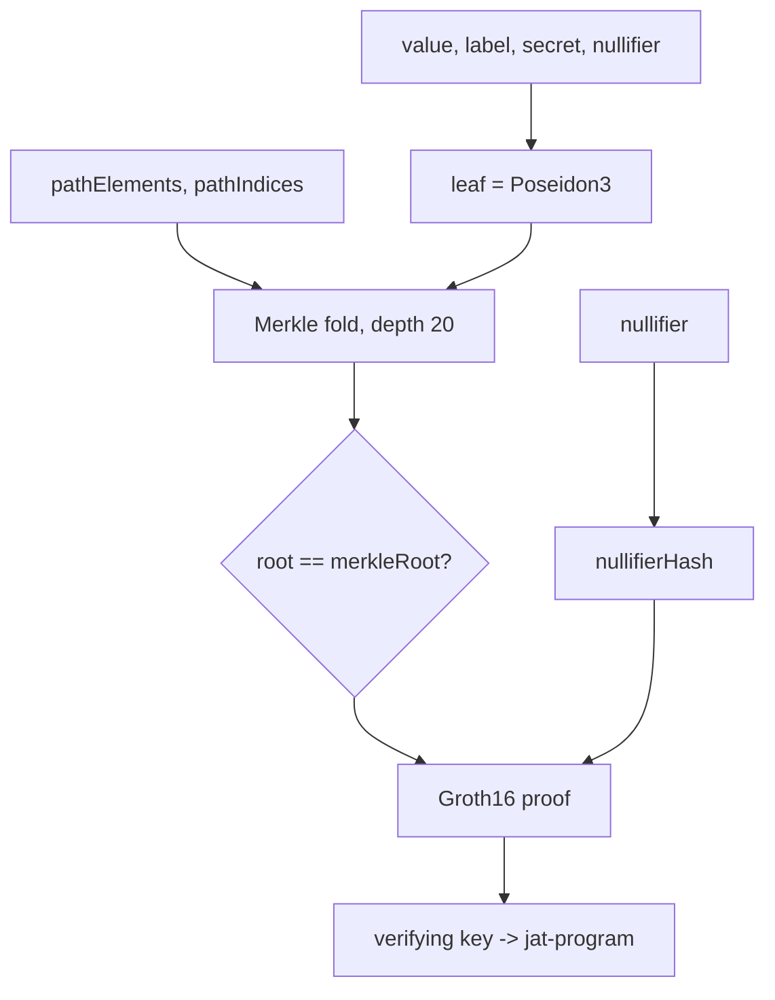

# jat-circuits

<p>
  <a href="https://github.com/Jatcotcash/jat-circuits/blob/main/LICENSE">
    
  </a>
  <a href="https://github.com/Jatcotcash/jat-circuits/actions/workflows/ci.yml">
    
  </a>
  
  
  
  <a href="https://github.com/Jatcotcash/jat-circuits/commits/main">
    
  </a>
</p>

Zero-knowledge circuits for **Jat**, private payments on Solana. These are the Circom
circuits and the tooling that turns them into a verifying key the on-chain program checks.
The originals are in `circuits/` and `scripts/`; `node_modules/circomlib` is a vendored
build dependency, not first-party.

## What is here

- **Withdraw circuit**: proves membership of a commitment in the pool Merkle tree, reveals
  the exact value, binds the payout to a specific recipient, and exposes a global single-use
  nullifier hash, while keeping the path and secrets private.
- **Gate circuit (`seal`)**: proves membership and `value >= threshold` (64-bit range gate),
  and exposes a context-scoped single-use nullifier.
- **Commitment helpers**: the Poseidon scheme
  `leaf = Poseidon(value, label, Poseidon(nullifier, secret))`.
- `scripts/`: input generation, proof to on-chain bytes conversion, verifying-key to Rust
  export used by `jat-program`, and a devnet end-to-end script.

Curve BN254, proof system Groth16, hashing Poseidon, matched byte for byte against the
on-chain Solana Poseidon syscall.

## Circuits

| Circuit | Public inputs | Reveals | Nullifier |
| --- | --- | --- | --- |
| `seal` (gate) | merkleRoot, threshold, contextHash, nullifierHash | nothing about value beyond `>= threshold` | `Poseidon(nullifier, contextHash)`, per context |
| `withdraw` | merkleRoot, value, recipientHash, nullifierHash | exact value, bound recipient | `Poseidon(nullifier)`, global |

## Architecture



## Build

```bash
git clone https://github.com/Jatcotcash/jat-circuits
cd peepy-labs
npm install

# compile a circuit, generate an input, build a proof, export the verifying key
npm run compile:withdraw
node scripts/gen_withdraw_input.mjs
node scripts/proof_to_bytes.mjs
node scripts/vk_to_rust.mjs
```

Powers-of-tau (`*.ptau`) and intermediate `*_0/_1.zkey` files are gitignored because they
are large and regenerable. Final proving keys and verifying keys are kept.

## Project structure

```
peepy-labs/
  circuits/
    seal.circom         gate: membership + range + scoped nullifier
    withdraw.circom     withdraw: membership + value + recipient + global nullifier
    *_final.zkey        final proving keys (dev setup)
    *_vkey.json         verifying keys
    *_js/               circom-generated witness wasm
  scripts/
    gen_input.mjs            gate witness input
    gen_withdraw_input.mjs   withdraw witness input
    proof_to_bytes.mjs       snarkjs proof -> on-chain byte layout
    vk_to_rust.mjs           verifying key -> Rust for jat-program
    contribute.mjs           one trusted-setup contribution
    e2e_devnet.mjs           end-to-end against devnet
    spike_poseidon.mjs       Poseidon parity vs the Solana syscall
    spike_tree.mjs           incremental tree parity
```

## Status

Devnet-grade. The trusted setup here is for development. A real deployment needs a
multi-party ceremony, which `jat-program/CEREMONY.md` describes.

## Contributing

See [CONTRIBUTING.md](CONTRIBUTING.md) and [CODE_OF_CONDUCT.md](CODE_OF_CONDUCT.md).

## License

MIT, see [LICENSE](LICENSE).

## Links

- On-chain programs: https://github.com/Jatcotcash/jat-program
- SDK and services: https://github.com/Jatcotcash/jat-sdk
